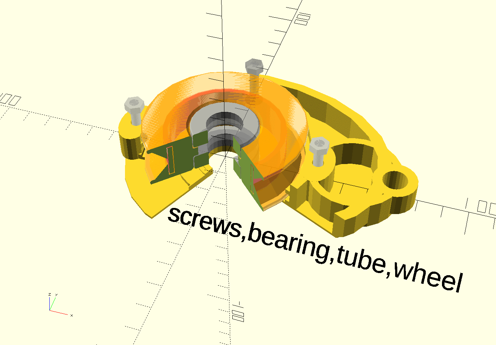

## License

This work is dual-licensed under GPL 2.0  or CERN-OHL-W .

*You can choose between one of them if you use this work.*

`SPDX-License-Identifier: GPL-2.0  OR CERN-OHL-W`

# Constructive Library: 
Extends OpenScad Language for complex and complementary mechanical parts with less mathematical code. Offers a "Stamping"  approach to quickly create mechanical parts fitting and complementing one another. This is used as a replacement for Constraints known form other CAD systems
Easily create holes from modules and overcome many Openscad's limitiations for complex models using the library's own syntax. 

*Compiles directly by OpenScad*. No other tools needed. Just include the:
_constructive-compiled.scad_ in your .scad file, that is all.

----


Constructive Library (about 1900 lines of Code)
introduces a different approach to OpenScad Syntax: you *rarely need difference(), for(),intersection()* or their one-to-one equivalents, In the *library's own dialect a for()* block might look like:

pieces(4) X(every(35)) turnXY (vals(10,25,-15,40)) cube(10);

It is all *valid OpenScad*, you do not need any additional programs, just the OpenScad and the constructive-compiled.scad file.

The Constuctive-Syntax tries to align more with mechanical construction of parts and less with mathematical concepts like arrays, vectors and functions. (but they are heavily used behind the scenes). So it aims to be more concise and fluent for mechanical parts than vanilla OpenScad. It allows you to make holes from Modules and really good deal more.

NOTE: if you use a  development version openscad, please make sure the experimental option "lazy Unions" is tuned off under Settings. This experiment breaks Openscads compatibility and you might encounter problems with this library also.


For a **basic introduction** (specially if you are new to Openscad )
see the [beginners tutorial](./tutorials/basic-tutorial.md) it explains Constructive Syntax for main Building blocks, like tube(), box() or bentStrip() and their placement and alignment in space like stack() , align(),  X(),Y(),Z() or turnXZ() 

[Part II tutorial](./tutorials/tutorial-partII.md) shows somee basic object modification like reflectX(), cScale() ,or colors and then goes on to explain, how to work with sets of similar objects without for(), with: pieces(), span(), vals(), selectPieces(), etc..

[Part III tutorial](./tutorials/tutorial-partIII.md) shows more advanced Features like grouping commands into a g() group, working with Parts, and combinig them into Assembly 


__if you have questions you can ask me on the Openscad mailing list: https://lists.openscad.org/list/discuss.lists.openscad.org . Just add: constructive-lib to your subject to make sure i will see it__


For a more advanced use also look at the explanations inside the example below

https://github.com/solidboredom/constructive/blob/main/examples/mount-demo.scad

there is also another Example at:

https://github.com/solidboredom/constructive/blob/main/examples/pulley-demo.scad


>Note: Here A Gallery where some shiny constructive examples will be added, 
to show what can be acheived

https://github.com/solidboredom/constructive/blob/main/gallery/	

>Note: see here the source code ofthe Gallery pieces here:
https://github.com/solidboredom/constructive/blob/main/gallery/sources/

how little code is actually needed for this,
the code is in part not commented nor cleaned up, but it still can be used for reference

-------------------
The easiest way to try out the Library is to download the [kickstart.zip](https://github.com/solidboredom/constructive/blob/main/kickstart.zip)


Still uncovered are inverse transformations like in:

g(X(10),Y(15),turnXY(45),X(30))

```
g(backwards([X(10),Y(15),turnXY(45),X(30)])

    box(10);
```

also part inheritance, part selector prefixes, internal type Ssystem and some more features

Try it! i hope you will find it as useful as i do.

Peter
