# Basic introduction to openscad with the <u>Constructive</u> library for a new OpenScad user

--------------------
A **basic introduction** (especially if you are new to Openscad )
it explains Constructive Syntax for main Building blocks, like tube(), box() or bentStrip() and their placement and alignment in space like stack() , align(),  X(),Y(),Z() or turnXZ() 

--- 
see also:
[Part II tutorial](./tutorial-partII.md) shows some basic object modification like reflectX(), cScale() ,or colors and then goes on to explain, how to work with sets of similar objects without for(), with: pieces(), span(), vals(), selectPieces(), etc..

[Part III tutorial](./tutorial-partIII.md) shows more advanced Features like grouping commands into a g() group, working with Parts, and combining them into Assembly 

----

The easiest way to try out the Library is to download the [kickstart.zip](https://github.com/solidboredom/constructive/blob/main/kickstart.zip)

----------------

> NOTE: To run all code examples from this tutorial you will need only Openscad and
> a single file: `constructive-compiled.scad` put it in the same Folder as your own .scad files. (or into the OpenScad Library folder)
> the easiest way to start is to download the [kickstart.zip](https://github.com/solidboredom/constructive/blob/main/kickstart.zip)
> and then extract both files contained in it into same folder. Then you can open the tryExamples.scad from this folder with OpenScad, and then use this file to try the code Examples from the Tutorial, or anything else you like. Just Pressing F5 in Openscad to see the Results.

---

## Basic building blocks

here are the basic buildng blocks box(),tube(),tubeShell(), and ball(),ballShell()
they are very similar to OpenScad's native cube(),cylinder() and sphere() but have simpler, less mathematical argument syntax and additionally allow for powerful Constructive features introduced later .
There are other more advanced blocks and features, such as bentStripXZ() or applying of chamfer(), which have no vanilla Openscad equivalent, the will be explained later
#### Basic building block : box()

```.scad
include <constructive-compiled.scad>

box(side=10);
```

This will create a box, all box sides of side=10 mm and with its center around center of coordinates.
Same as cube([10,10,10],center=true) in vanilla Openscad syntax.

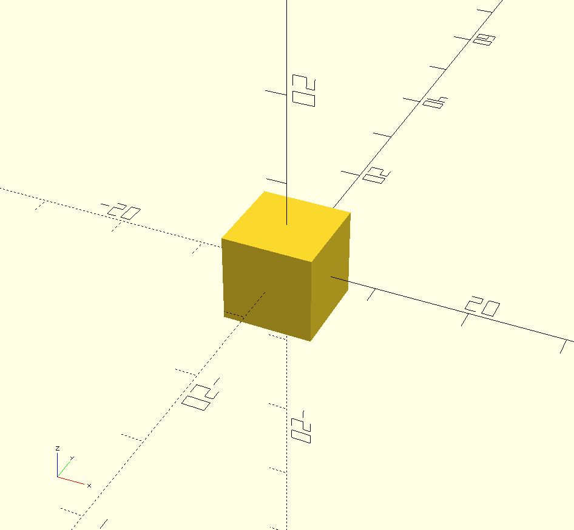  

---

> NOTE: for people used to classic vanilla openscad:
> unless specified differently by TOUP(),TORIGHT(),align(...), etc.(which are explained below) all box(), tube() and other "constructive" bodies will be centered around center of coordinates, like when using ",center=true)" parameter in vanilla Openscad.

---

In constructive syntax you can also omit the parameter name for the 'side=' parameter.
So:

```.scad
include <constructive-compiled.scad>

box(10);
```

Does exactly the same as box(side=10);

---

```.scad
include <constructive-compiled.scad>

box(10,h=15);
```

Just like above, a box with all sides of 10, but a height of h=15.
Same as cube([10,10,15],center=true) in vanilla Openscad syntax.

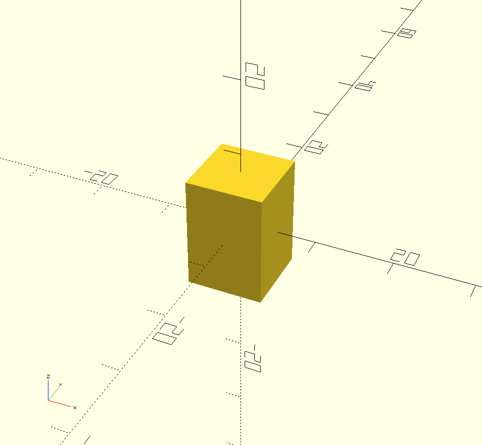  

---

```.scad
include <constructive-compiled.scad>

box(10,y=25,h=15);
```

Like above,  a box with all sides of 10, but a height of h=15 and a depth of y=25.
Same as cube([10,25,15],center=true) in vanilla Openscad syntax.

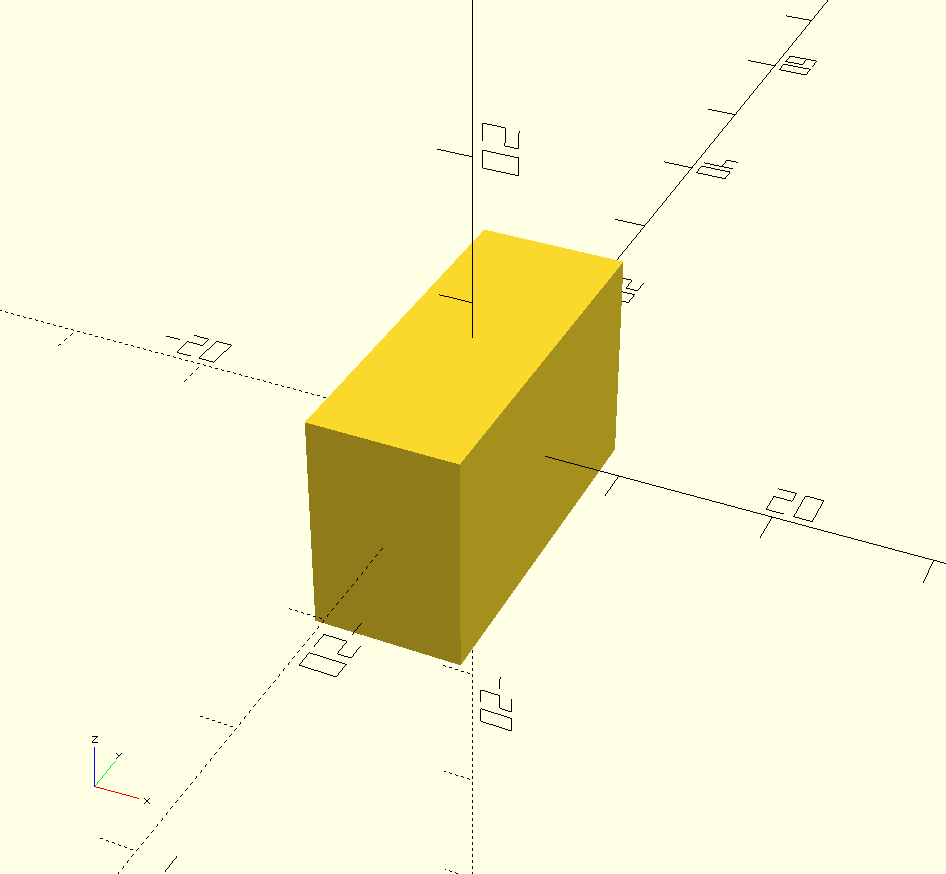
---

```.scad
include <constructive-compiled.scad>

box(10,x=35,h=15);
```

A cube with a side of 10 , but x=35 and h=15, so that only the remaining unset y will get the value of 10: y=10
same as cube([35,15,15],center=true) in vanilla Openscad syntax.

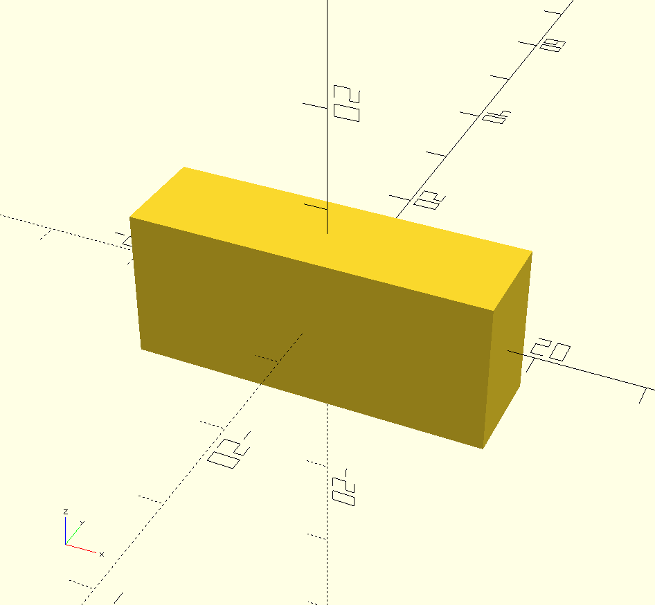
---

> NOTE: all the examples here will work in openscad's preview (F5-Key), but later you might need to render them correctly, when (pressing the F6-key) or exporting them as .stl, you will need
> to add one more simple line to your code to achieve that. This line is called "a main() block". It is given and described at the very end of this tutorial

---
#### Basic building block: ball(diameter)
Creates a ball (a sphere() in vanilla OpenScad of given diameter ) it works just the same as sphere()
but it also correctly reacts on align(), stack() and other Constructive concepts described below. Out of the box. So it is preferred to use ball(d) instead of sphere()

```.scad

include <constructive-compiled.scad>
ball(10);

```
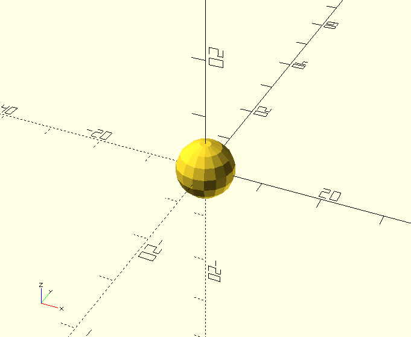

---
#### Basic building block: ball(diameter)
creates a hollow ball shell (a pin pong ball) (the space inside Ball is not a "Hard" cavity, it is not affecting/erasing other bodies inside it.
but it also correctly reacts on align(), stack() and other Constructive concepts described below. out of the box. so it is preferred to use ball(d) instead of sphere()

```.scad

include <constructive-compiled.scad>
ballShell(10);

```


---

ballShell(d=heightInfo(),wall=wallInfo())


#### Basic building block: tube()

```.scad
include <constructive-compiled.scad>

tube(d=10,h=20,wall=2.5);  
```

Creates a tube with outer Diameter of 10,a wall of 2.5 and height of 20mm
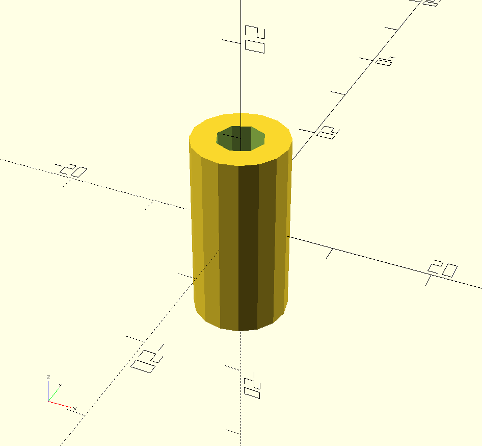  

---
#### Basic building block: tubeShell()

```.scad
// the code for this example needs some additional features like assemble() so it is documented in
the Part 3 ofthis Tutorial
```

equivalent to a tube() , 
but the bore inside Ball is not a "Hard" cavity, it is not affecting/erasing other bodies inside it.

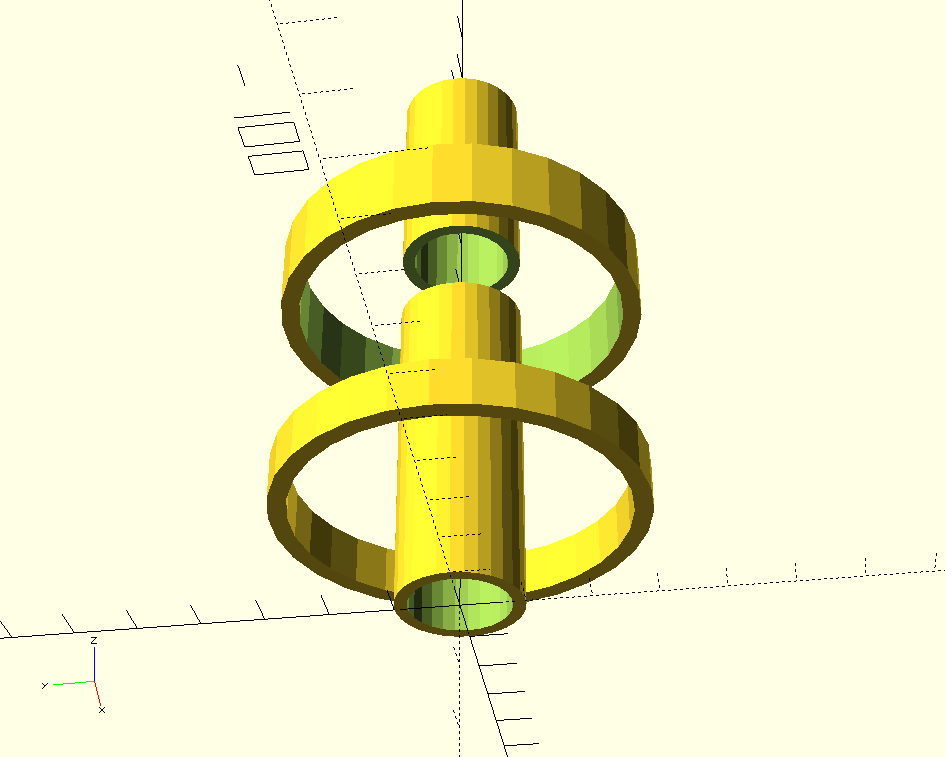  

---
```.scad
include <constructive-compiled.scad>

tube(dOuter=45,dInner=25,h=20);  
```

Just like above, but instead of specifying just d and wall thickness it is possible to specify dInner and dOuter.

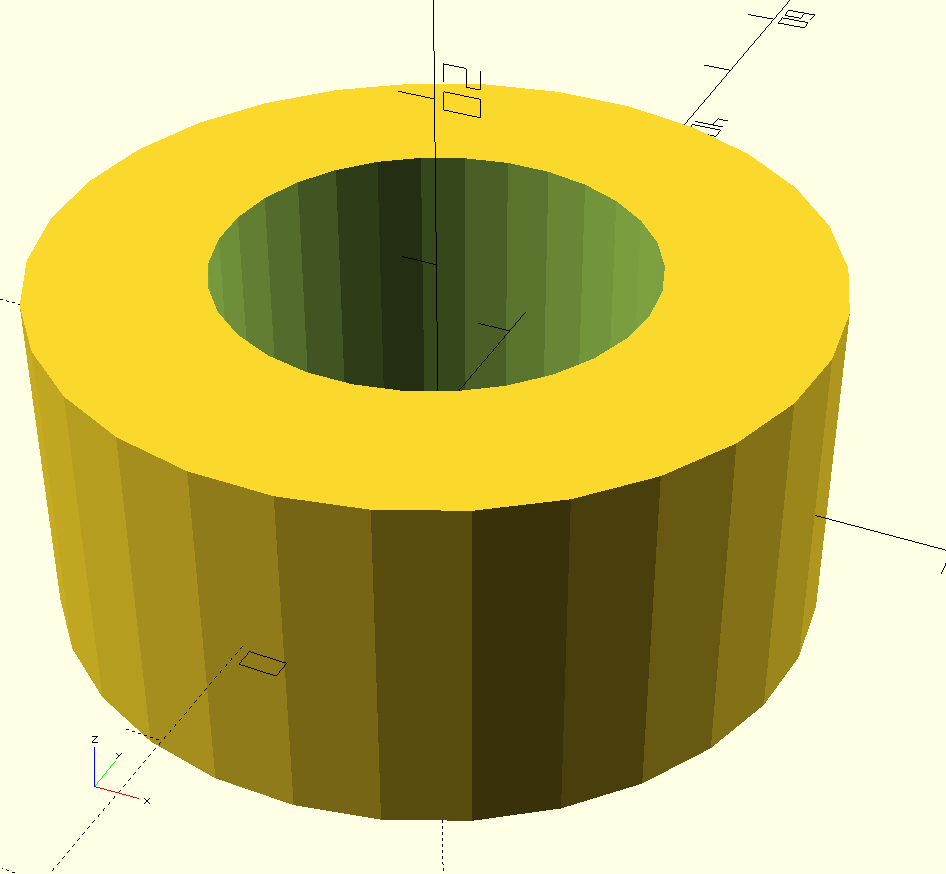  ---

```.scad
include <constructive-compiled.scad>

tube(d=10,h=20,solid=true);
```

Creates a solid rod of d=10 in diameter and height of h=20, the solid=true argument is one of the ways to make the rod solid,skipping the inner hole, which would turn it into a proper tube;
in vanilla Openscad syntax this would be cylinder(d=10,h=20);
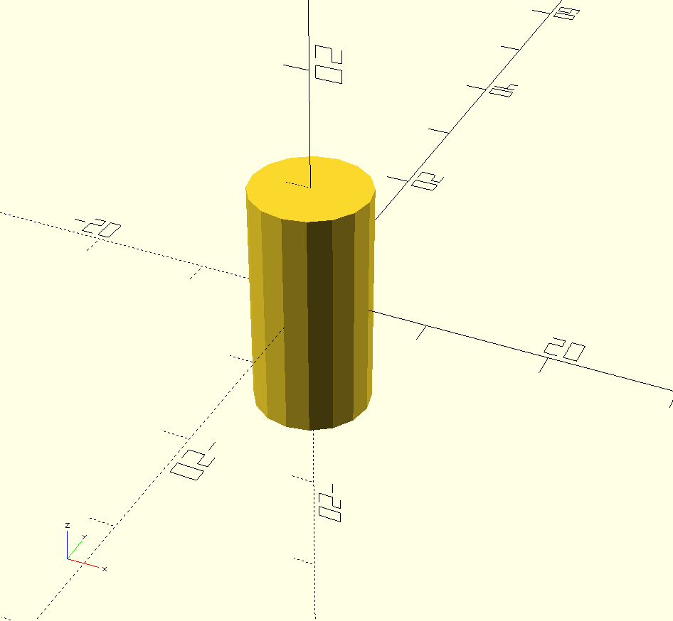  

----
## Moving and turning the Object around (also called translation and transformation):
---
#### moving:

The first box  with the side of (4 mm) is moved by 5mm to the right
the second box with a 8mm side is moved by 13mm to the bottom since the negative Z(-13)

```.scad
include <constructive-compiled.scad>

X(5) box(4);
Z(-13) box(8);
```

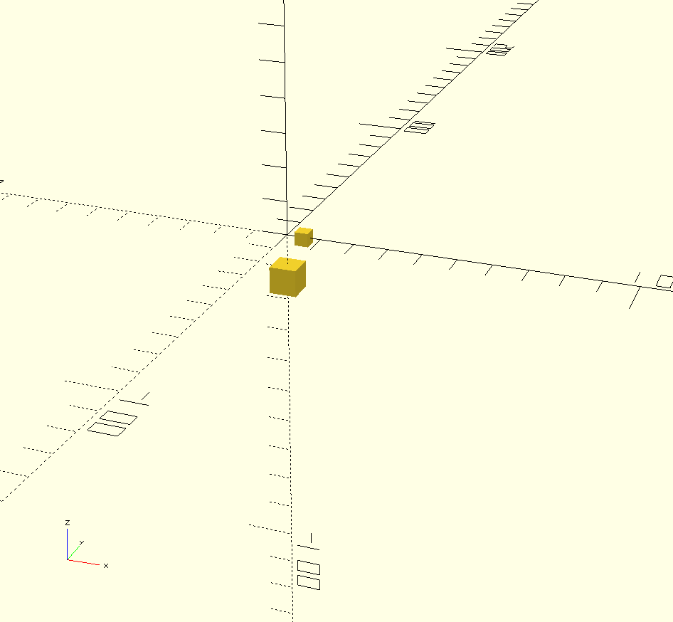

---

#### Applying several Movements to one Object:

Here we have several boxes scattered around. The first and the biggest box  of 15 mm sides is moved by 8mm to the right by X(8) then by 20mm to the front and by 30 mm up

```.scad
include <constructive-compiled.scad>

X(8) Y(-20) Z(-30) box(15);
X(5) box(4);
Z(13) box(5);
Y(-24) box(3);
```

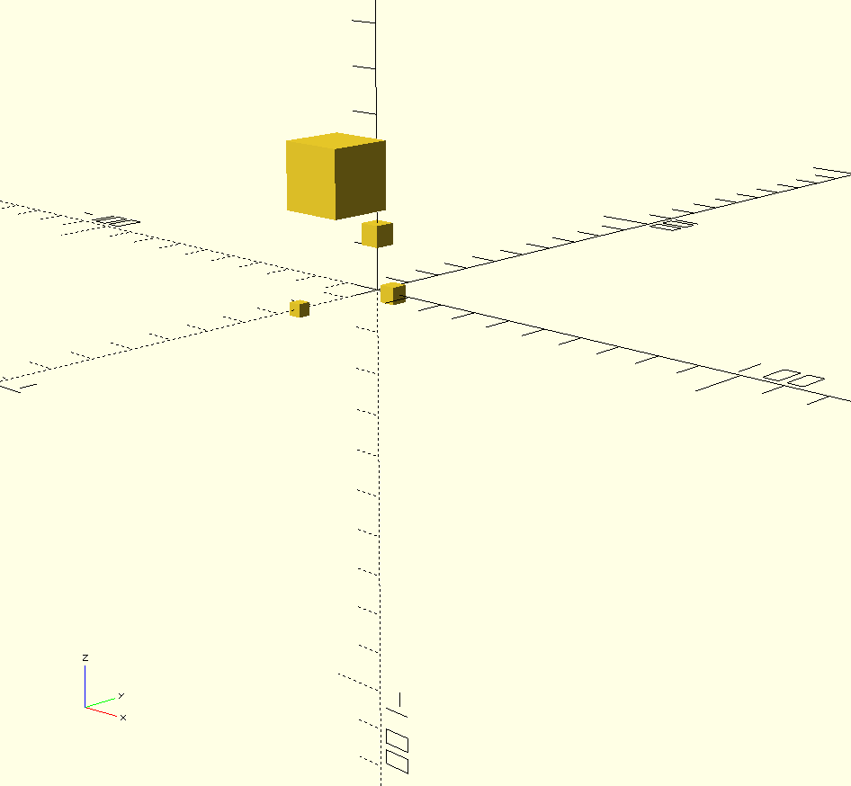

---

## Turning Objects :

```.scad
include <constructive-compiled.scad>

turnXY(45) box(10);
```

This turns the box by 45 degrees in the horizontal(XY) plane

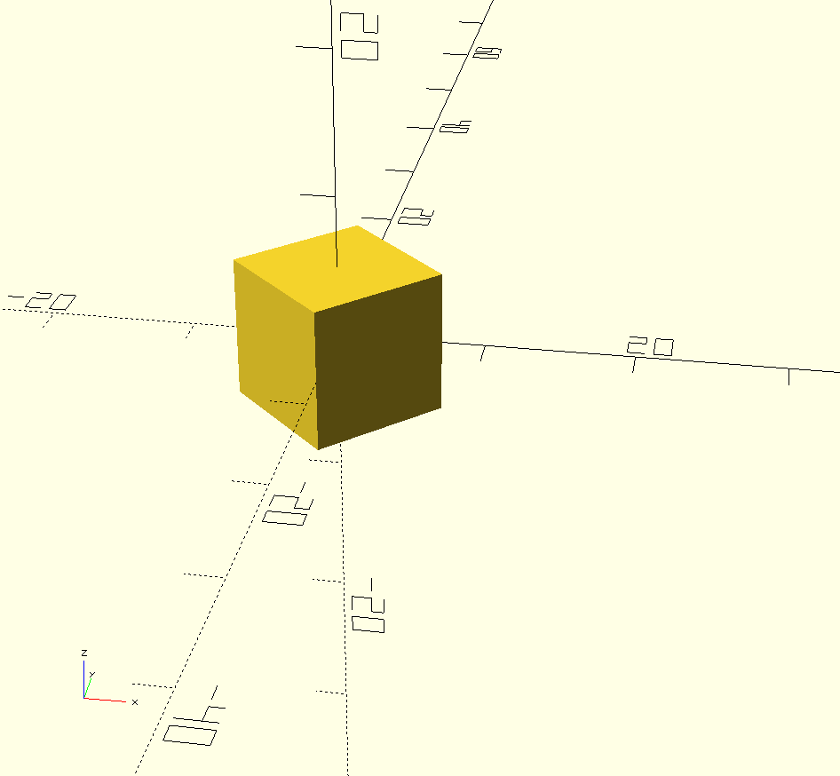

---

Turns are also possible around each of the other two axes: turnXY(), turnXZ() and turnYZ(), and you of course can apply several different turns to the same objects

```.scad
include <constructive-compiled.scad>

turnXZ(-30) turnXY(45) box(10);
```

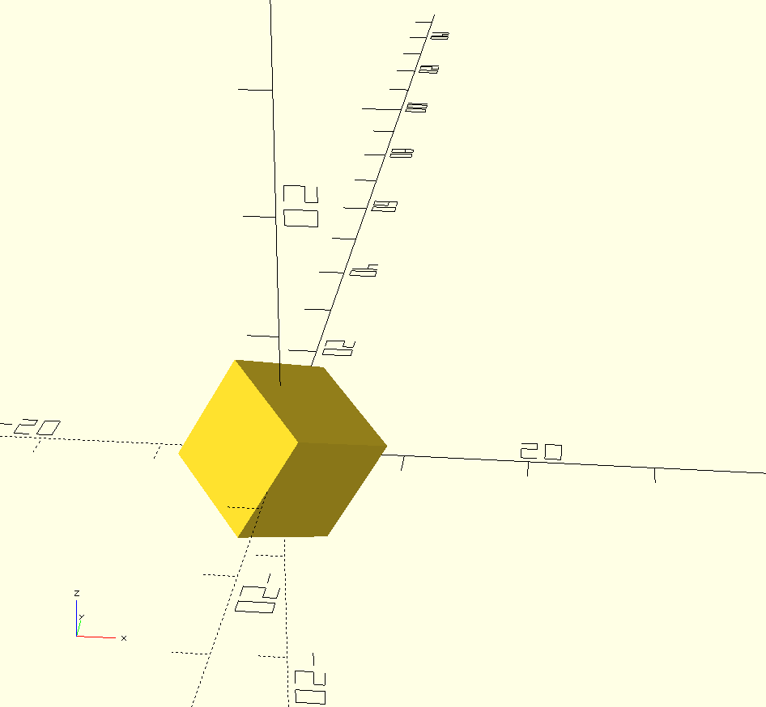
---

You can combine turns and moves as you wish:

```.scad
include <constructive-compiled.scad>

turnXZ(-30) X(5) Y(10) turnXY(45) Z(15) box(10);
```

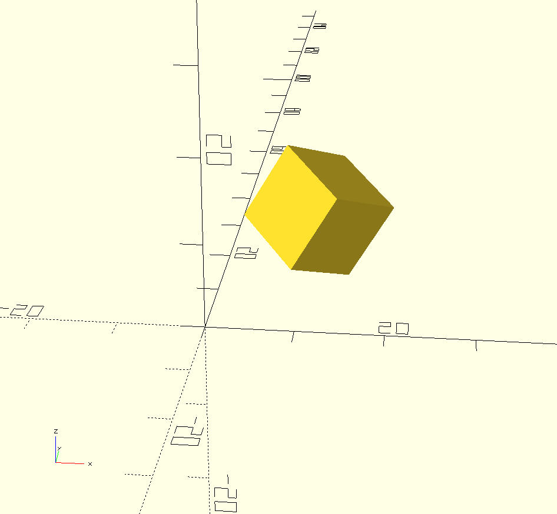

This will move the box up by 10 mm, turn it by 45 degrees in the horizontal(XY) plane, and the move it 10 in y axis and 5 to the right and then turn the whole thing around XZ axis by -30 degrees

> NOTE: the sequence in which you apply turns and moves does matter.
>
> Because the
>
> turnXZ(30) X(20) box(10);
>
> first moves the box by 20 mm and then rotates the whole arrangement around the center of coordinates, whereas the
>  X(20) turnXZ(30) box(10);
>
> first rotates the box around its own axis and then moves it to the right by 20 mm
> you can try it by yourself , just not forget the
>
> include <constructive-compiled.scad>
>
> at the beginning

---------------
----
### Advanced body Positioning: aligning a body relative to its coordinates:

Instead of moving the body around by using X() Y() or Z() it is very often handier to just specify that it needs to be aligned so that,
its specific corner or side touches a corner or side of another body, and let the Constructive do the moving. (This is called "creating a constraint" in a traditional CAD)
here is an example:

```.scad
include <constructive-compiled.scad>

TOUP()box(10);
TODOWN()tube(d=10,h=10,solid=true);
```

The alignment moves the body around,so that not its center, but one of it's corners, or a center of a chosen side of the body is place in the coordinates, where it is drawn.
Here the box() is aligned UP, for the complete body to be drown the top side of the coordinates center,just touching it with its bottom sides center,
and the tube is aligned Down to be to the Bottom of coordinates center, just touching it with its top sides center

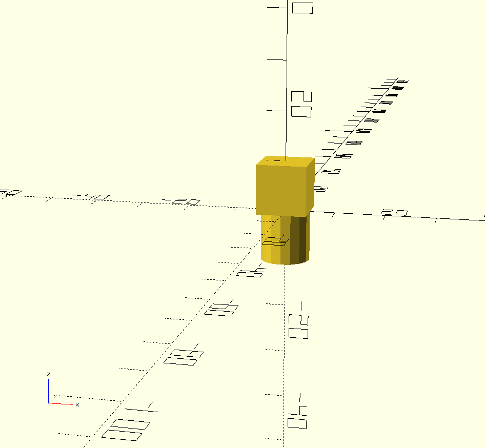

---

There are alignment commands for each dimension, not only TOUP() and TODOWN() but also TORIGHT() TOLEFT() for the X and TOREAR() and TOFRONT() for the Y axis

```.scad
include <constructive-compiled.scad>

TORIGHT() box(10);
TOLEFT() box(5,y=30);
```

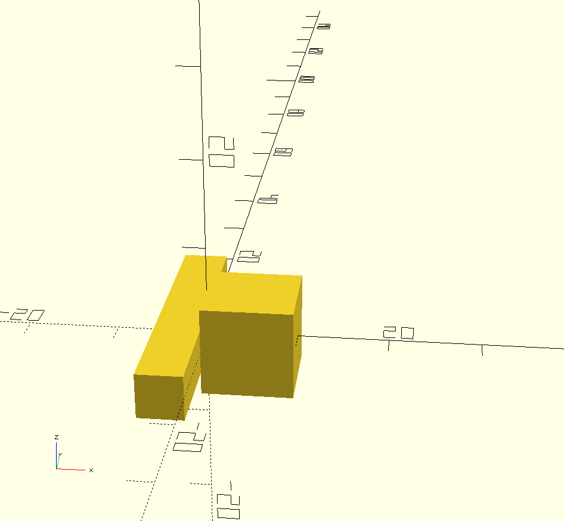

---

You can combine them like here

```.scad
include <constructive-compiled.scad>

TORIGHT() TOREAR() TOUP() box(5);
TODOWN() tube(d=20,h=20,wall=3);
```

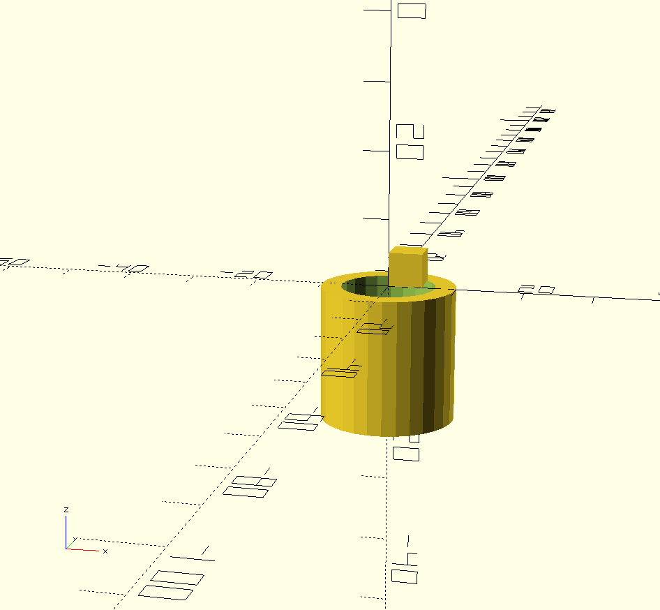

The TORIGHT() TOREAR() TOUP()  alignment is the default alignment for cube in vanilla Openscad, so that its cube([5,5,5]); will achieve the same as
TORIGHT() TOREAR() TOUP() box(5); in constructive dialect.
Why use the longer version?
Because it is possible to assign alignment over one axis to a block of several bodies,and then specify alignment on another axis to a specific body, like here:

```.scad
include <constructive-compiled.scad>
TOUP()
{
    TOLEFT()box(20);
    TORIGHT()box(10);
}

TODOWN()TOFRONT()tube(d=20,h=10,wall=2);
```

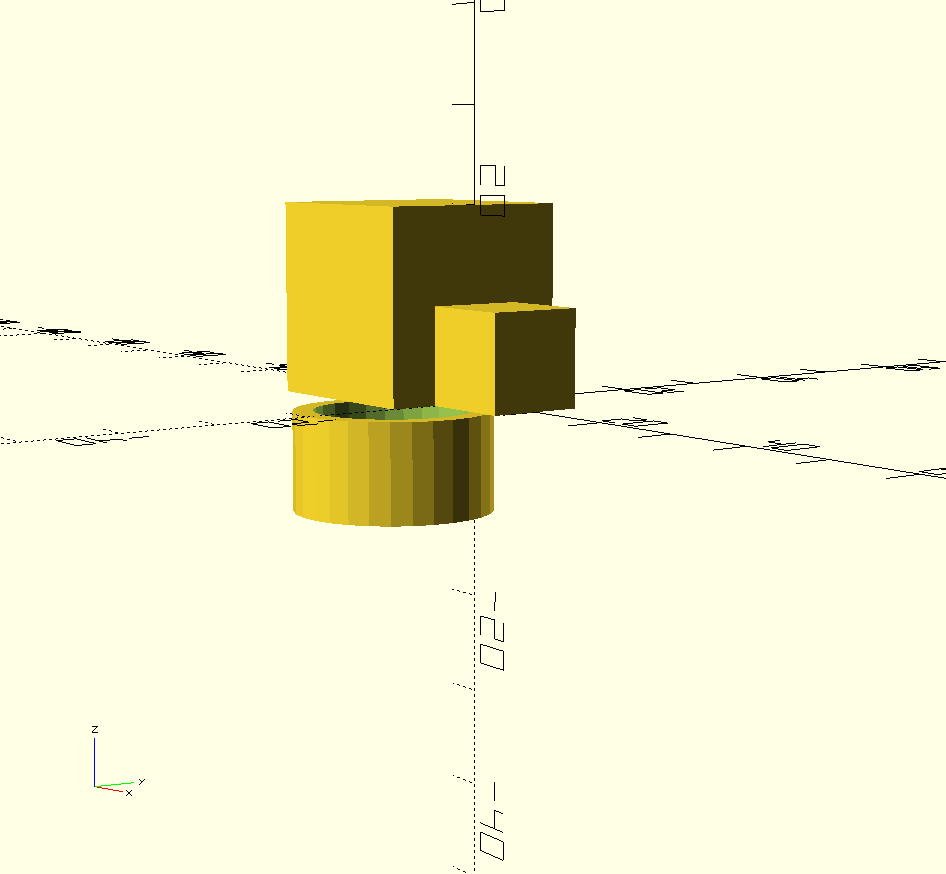
---

NOTE that  it is possible and in some cases needed to combine several following align statements like TOUP() TORIGHT() into a  shorter single align(...) command:
align(TORIGHT, TOREAR, TOUP) box(5); does the same  as the TORIGHT() TOREAR() TOUP() box(5); from above.
In fact, TOUP() is only as short for align(TOUP) and TORIGHT() for align (TORIGHT), etc.

---

#### Stacking Bodies on top or to side

When you have similar bodies stacked on top each other, or to a side, than in vanilla openscad you would have to move each body to the exact position it needs to be, not so with Constructive.
You just stack Bodies like that, just set the direction of Stacking:

> IMPORTANT: please pay attention there are NO SEMICOLONS between stacked parts.
> his looks very unusual, but this is essential for stack() to work. If stack is not working properly, usually there is a semicolon between stacked bodies somewhere:

```.scad
include <constructive-compiled.scad>
TOUP() stack(TOUP)
    box(20)
    box(15)
    box(10,h=30)
    tube(d=10,wall=2,h=20)
    tube(d=5,h=10,solid=true)
    turnXY(45)box(5);
```

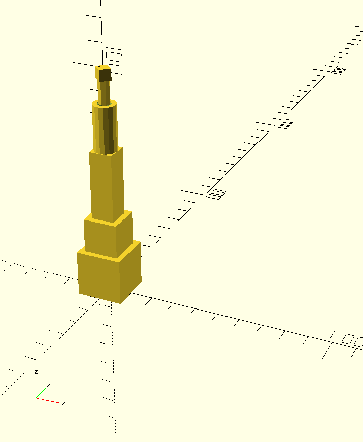

> note please do not forget the TOUP() alignment if you are using the stack(TOUP) this will align each individual body you are stacking in the same direction with the Stacking, only the then the Bodies are Stacked properly on top of each other.

---
----
## advanced building blocks
---

#### advanced building block: chamfer() : tube()

You can chamfer the tubes up and bottom sides just like the we did to the box(), or even add skirts.

```.scad
include <constructive-compiled.scad>

chamfer(4,-2) tube(d=10,h=20,wall=2.5);  
```

Chamfering with the chamfer() is only possible on the outer surface of the tube for now.
To chamfer the hole inside a tube in the current version of Constructive, it needs a little trick, we will return to the trick in another tutorial.

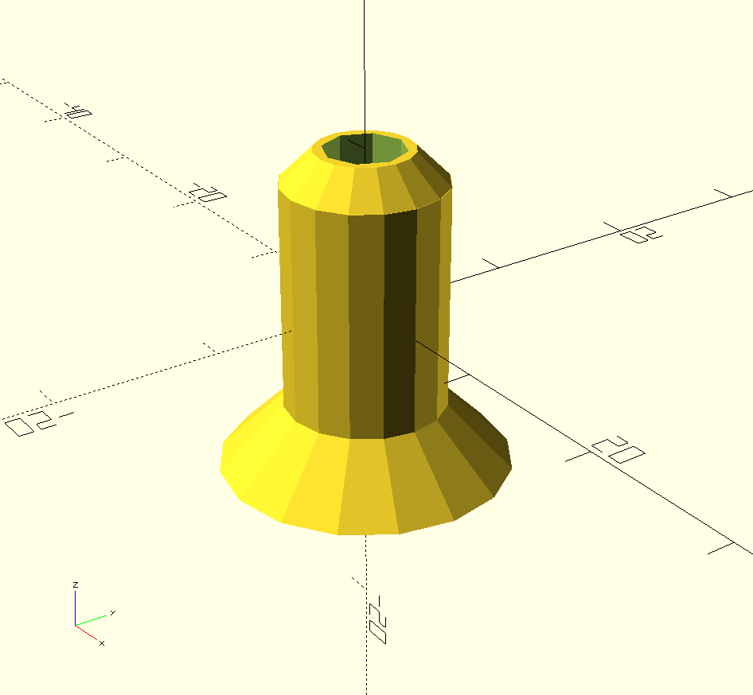


#### advanced building block: chamfer() : box()

You can easily chamfer the sides of a box() , just use chamfer(down,up,side) to set by how many millimeters the bottom,top, or side edges of the cube need to be cut, use negative numbers to indicate we want to remove material (and not to add a skirt)

```.scad
include <constructive-compiled.scad>

chamfer(-1,-2,-3)box(10,x=35,h=15);
```


---

If you want smoother rounded vertical edges set fnCorner parameter to a higher value than its default fnCorner=7

```.scad
include <constructive-compiled.scad>

chamfer(-1,-2,-3,fnCorner=60) box(10,x=35,h=15);
```

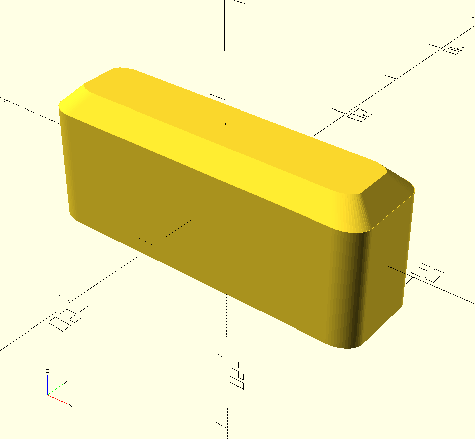

---

Or make them straight with fncorner=2

```.scad
include <constructive-compiled.scad>

chamfer(-1,-2,-3,fnCorner=2) box(10,x=35,h=15);
```

Or anything in between with value you choose

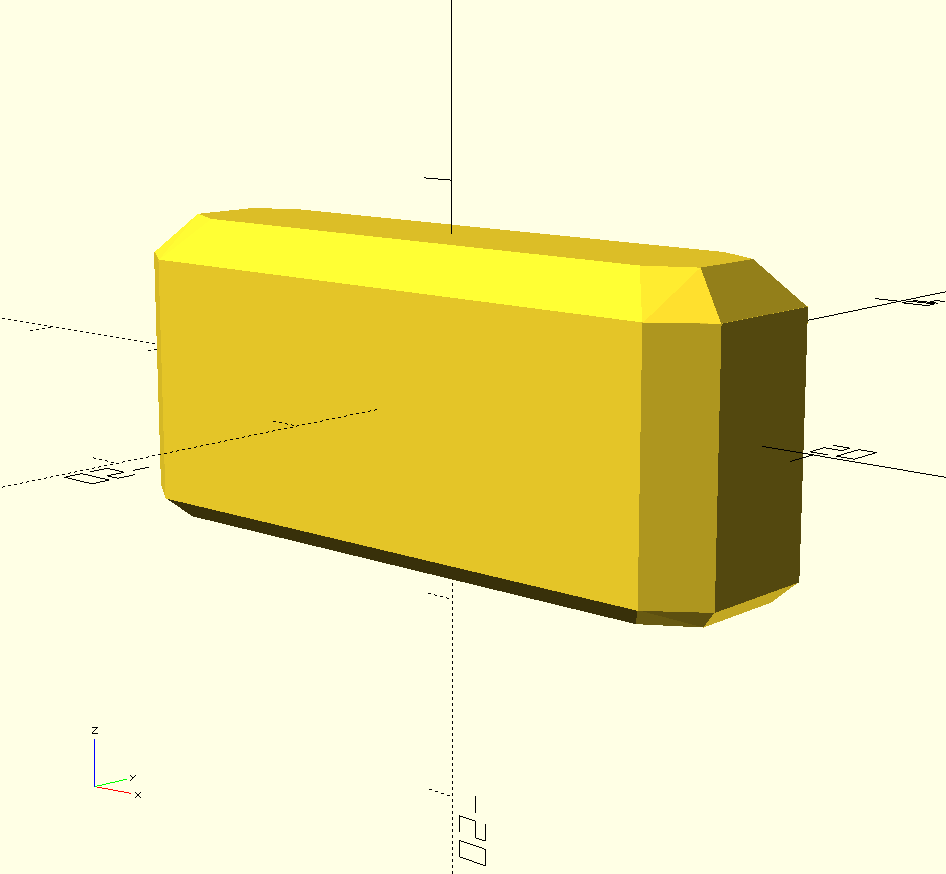
---

Or to chamfer only the sides the top, but not bottom, or otherwise:

```.scad
include <constructive-compiled.scad>

chamfer(0,-2,-3) box(10,x=35,h=15);
```

Or anything in between with value you choose

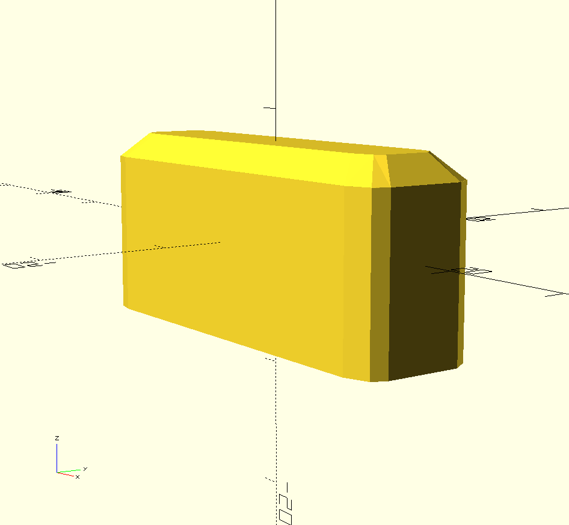

---

####Skirt
You can also create a skirt at the top or bottom using chamfer() but with a positive parameter for according side

```.scad
include <constructive-compiled.scad>

chamfer(2,-2) box(10,x=35,h=15);
```

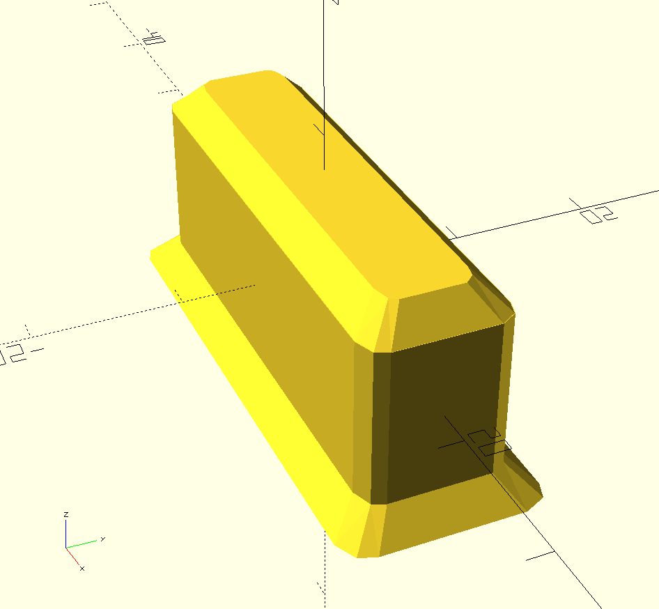

---

#### advanced building block: bentStripXZ()

```.scad
include <constructive-compiled.scad>

bentStripXZ(places=[ X(20),turnXZ(60),X(20),turnXZ(-45),X(10) ],
             y=5, thick=10);
```

This will create a 3D strip by moving a cylindrical base element of height y=5 according to command-list in its first argument places=[ ... ]

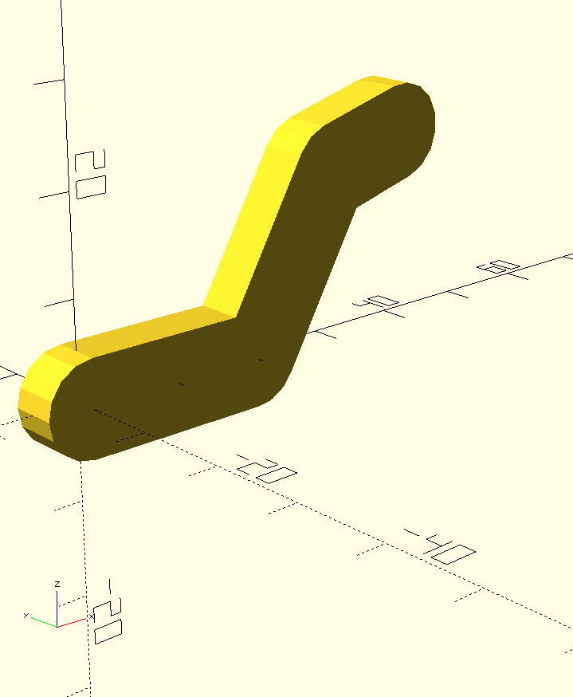  

> NOTE: ONLY TURNS/MOVES in XZ plane are allowed inside places parameter
> no alignment commands, like TOUP() or TOLEFT() are allowed in current version.

#### Advanced stacking Example

Here is a very similar Example, but we stack horizontally, and also apply chamfer() to remove 2 mm form the top and bottom sides edges, just to make them look better:

```.scad
include <constructive-compiled.scad>
chamfer(-2,-2)TORIGHT()stack(TORIGHT)
    box(20)
    box(15)
    box(10,h=30)
    tube(d=10,wall=2,h=20)
    tube(d=5,h=10,solid=true)
    turnXY(45)box(5);
```

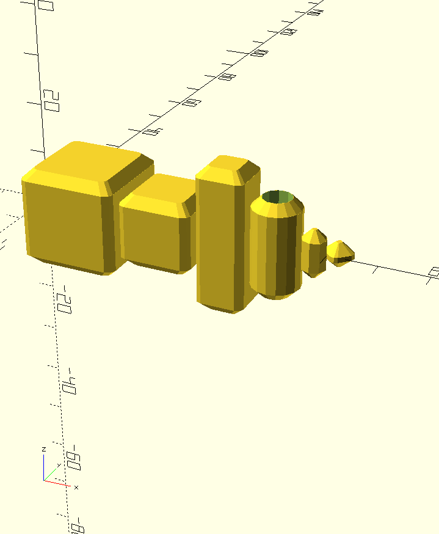

> note please do not forget the TOUP() alignment if you are using the stack(TOUP) this will align each individual body you are stacking in the same direction with the Stacking, only the then the Bodies are Stacked properly on top of each other.

---------------------

##  Main() block:

To be able to render the above examples with F6 or export their .stl you will need to wrap your code with the so called main () block statement.
You just do it by adding the assemble() add() line at the top of the code, just after the include line :

```
include <constructive-compiled.scad>

assemble() add()
```

And then wrapping the rest of your own code as code block, using curly braces:

```
include <constructive-compiled.scad>

assemble() add()
{
 .... your code here.....
}
```

So for example, a program:

```
include <constructive-compiled.scad>

chamfer(-2,-2)TORIGHT()stack(TORIGHT)
    box(20)
    box(15)
    box(10,h=30)
    tube(d=10,wall=2,h=20)
    tube(d=5,h=10,solid=true)
    turnXY(45)box(5);

TODOWN()TOREAR()tube(d=20,h=10,wall=2);
```

Will become:

```
include <constructive-compiled.scad>

assemble() add()
{
chamfer(-2,-2)TORIGHT()stack(TORIGHT)
    box(20)
    box(15)
    box(10,h=30)
    tube(d=10,wall=2,h=20)
    tube(d=5,h=10,solid=true)
    turnXY(45)box(5);

TODOWN()TOREAR()tube(d=20,h=10,wall=2);
}
```

The result looks just the same like this and renders well with (F6-Key) as well as F5
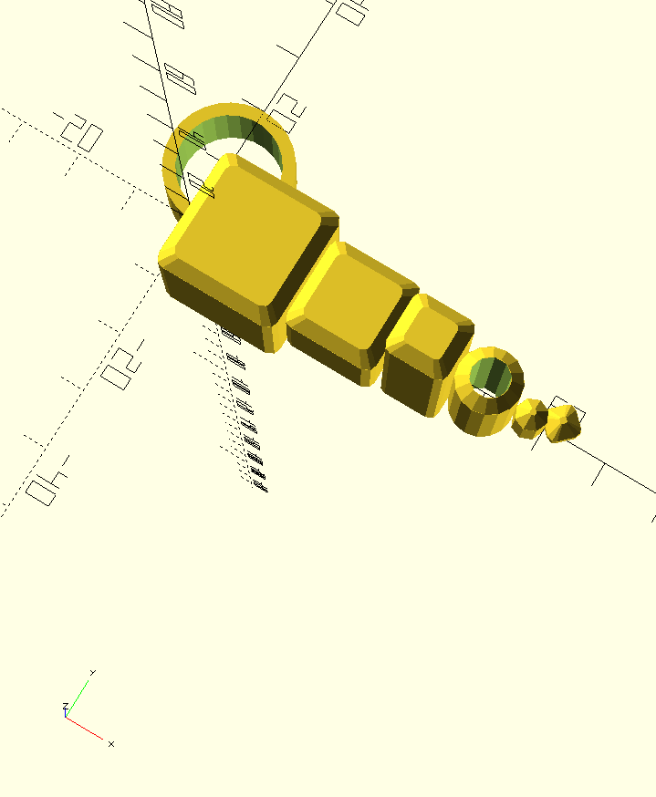

---

See also:

[Part II tutorial](./tutorial-partII.md) shows some basic object modification like reflectX(), cScale() ,or colors and then goes on to explain, how to work with sets of similar objects without for(), with: pieces(), span(), vals(), selectPieces(), etc..

[Part III tutorial](./tutorial-partIII.md) shows more advanced Features like grouping commands into a g() group, working with Parts, and combining them into Assembly 

For a more advanced use also look at the explanations inside the example below

https://github.com/solidboredom/constructive/blob/main/examples/mount-demo.scad

There is also another Example at:

https://github.com/solidboredom/constructive/blob/main/examples/pulley-demo.scad


The easiest way to try out the Library is to download the [kickstart.zip](https://github.com/solidboredom/constructive/blob/main/kickstart.zip)


That was it! Now you can render and export STLs
