# introduction to Openscad with the <u>Constructive</u> library for a new openscad user

### PART II


[Part II tutorial](./tutorial-partII.md) shows some basic object modification like reflectX(), cScale() or colors and then goes on to explain how to work with sets of similar objects without for(), with: pieces(), span(), vals(), selectPieces(), etc..

--------------------

If you are unsure about particular basic commands used in the codes snippets below, please refer to the [basic tutorial](./basic-tutorial.md).

[Part III tutorial](./tutorial-partIII.md) shows more advanced Features like grouping commands into a g() group, working with Parts, and combining them into Assembly 

For a more advanced use also look at the explanations inside the example below

https://github.com/solidboredom/constructive/blob/main/examples/mount-demo.scad

There is also another Example at:

https://github.com/solidboredom/constructive/blob/main/examples/pulley-demo.scad

-------------------
The easiest way to try out the Library is to download the [kickstart.zip](https://github.com/solidboredom/constructive/blob/main/kickstart.zip)


> NOTE: To run all code examples from this tutorial you will need only Openscad and
> a single file: `constructive-compiled.scad` put it in the same Folder as your own .scad files. (or into the OpenScad Library folder)
> the easiest way to start is to download the [kickstart.zip](https://github.com/solidboredom/constructive/blob/main/kickstart.zip)
> and then extract both files contained in it into same folder. Then you can open the tryExamples.scad from this folder with OpenScad, and then use this file to try the code Examples from the Tutorial, or anything else you like. Just Pressing F5 in Openscad to see the Results.

---

### body Colors
#### opaq(color),clear(color)
makes the Block of certain color and transparency
you can use opaq(color) as a short to native openscads color(color), and clear(color) as a short for color(color,.4)
a dozen of basic colors like red,green or silver
are defined as constants (see the sources/globals.scad)
so these color names can also be used without quotes
example:

```.scad
opaq(red)

clear(blue)
```

Other web colors will still need the quotes
Example: `opaq("lightblue")`
>NOTE: there is also an autocolor functionality for Parts introduced late in this tutorial after the parts() concept is introduced

### body transformations

#### reflectX(),reflectY(),reflectZ()

Put reflectX(), reflectX() or reflectZ() in front of a block to reflect it along the specific axis.
Example:

```.scad
include <constructive-compiled.scad>


reflectZ() TOUP()
{
  box(10,h=3);
  Z(3) ball(5);
}
//-----------
//and this Part of the example is not using reflectZ()
#TOUP()
{
  box(10,h=3);
  Z(3) ball(5);
}
```
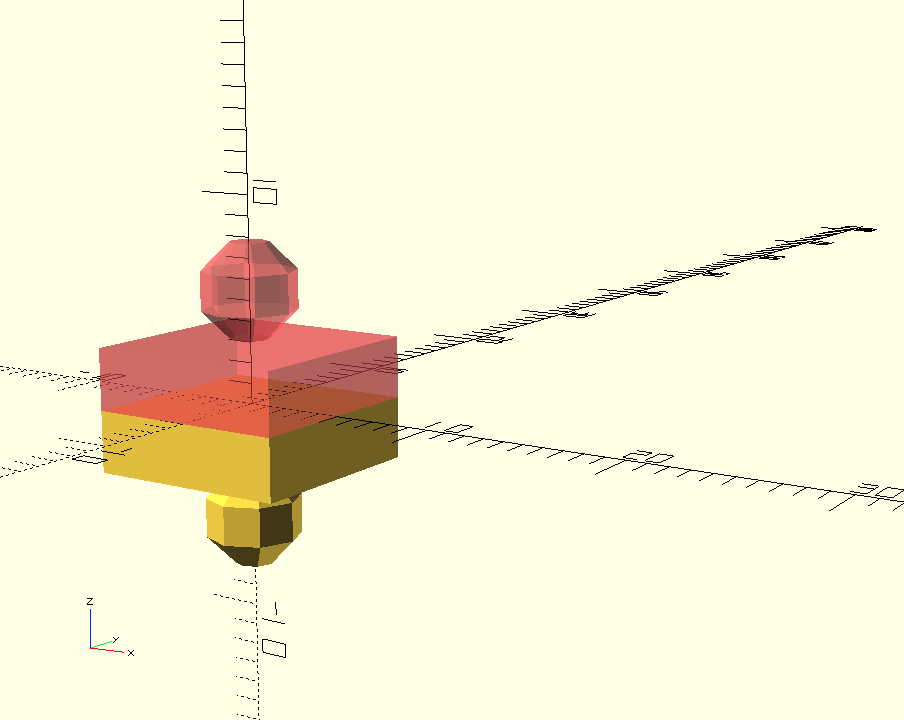

---

### cscale(x,y,z)
to resize a body or a block by a Factor
put cscale() in front of it.

```.scad
include <constructive-compiled.scad>

cscale(x=2)ball(20);
Y(-30) cscale(y=2,z=.5) ball(20);
```
cscale(x=2) doubles the size along the x axis, cscale(y=2,z=.5) doubles the y and halves z


>NOTE: when cscale(x,y,z) is used inside a g() group function its synonymous scale(x,y,z) can also be used instead
---

### Body duplication, "life without for()"

To create several similar bodies or say a sequence of holes in one object,
usually do not need to use for() and index variables, like in vanilla OpenScad. The command you use instead are less general, allowing to express the intent of what you trying to achieve in less code shorter and make it easier to understand:

### pieces(n) and every(distance)

When you need to create n similar bodies, instead of using vanilla openscad's for() you would use
pieces(n), so lets say we want to create 7 boxes (with side 10),and moving each up by 20 mm,
very short simple,no need to use variables:

```.scad
include <constructive-compiled.scad>

pieces(7) X(every(20)) box(10);
```

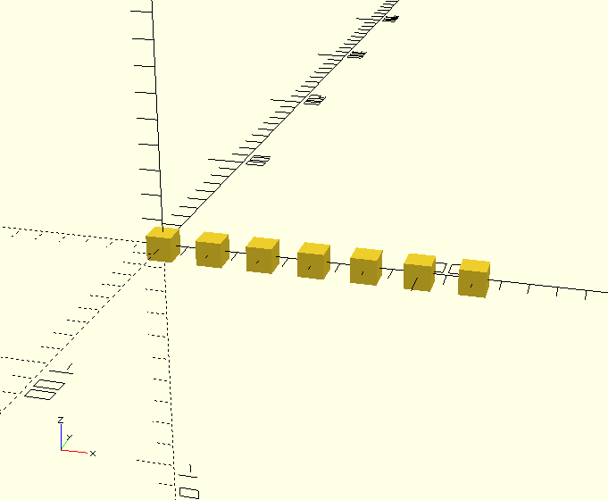
----

We can also make boxes all different, say increasing their height by 5 each

```.scad
include <constructive-compiled.scad>
pieces(7) X(every(20)) box(10,h=10+every(5));
```

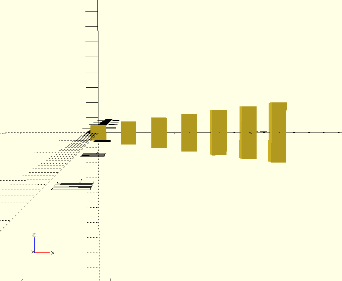

---

#### sides(distance)

Sides is useful to create two symmetrically placed or mirrored bodies.
Because "there are always two sides" sides() need to always be preceded by pieces(2) or by _two()_ which is a short for _pieces(2)_

`sides()` will always return -1 for the fist piece and 1 for the second piece.
If you use it with an argument like: sides(arg) it will return `-arg` for the first piece and `arg` for the second:

```.scad
include <constructive-compiled.scad>

two() X(sides(15)) ball(10);
```

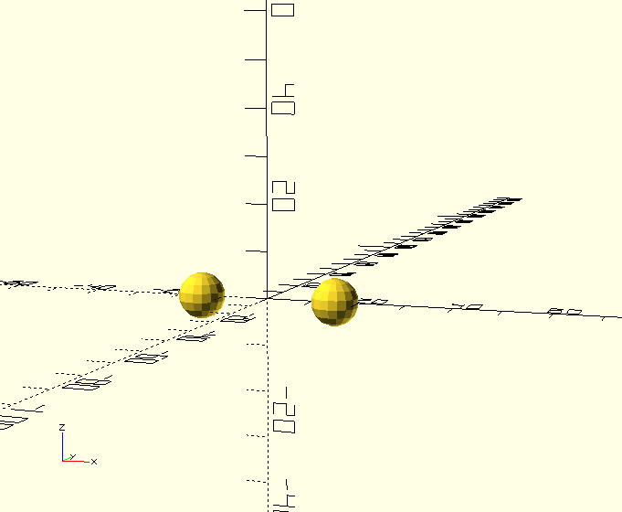
----

```.scad
include <constructive-compiled.scad>

two() X(sides(15)) turnXZ(-sides(30)) box(10);
```

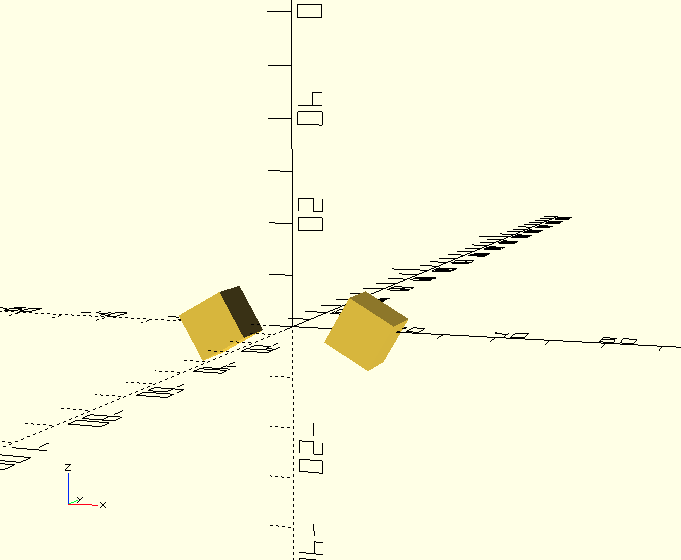
---

Or you can use relflectX() to achieve the same result, mirroring the right and left Parts

```.scad
include <constructive-compiled.scad>

two() reflectX(sides()) X(15) turnXZ(-30) box(10);
```

So it produces the same result as above


---

#### span(range) and pieces(n)

Sometimes you do not want to figure what would be the distance between neighbours you need to pass to every(distance) to say span 650 mm by 8 pieces, then it is handier to use span(range) than every(distance).

span(_range_) preceded by pieces(n) can (among other uses) be used to fill a range with a repetitive body.

Used inside of a pieces(_n_) block to automatically calculate values for each call, so that the _n_ values will evenly cover the whole _range_. It is like using a for(), but the step is determined automatically along lines of step = range/pieces

For example:

```.scad
include <constructive-compiled.scad>

pieces(5) X(span(100)) box(10);
```

Will fill a range of 100mm with box of side 10
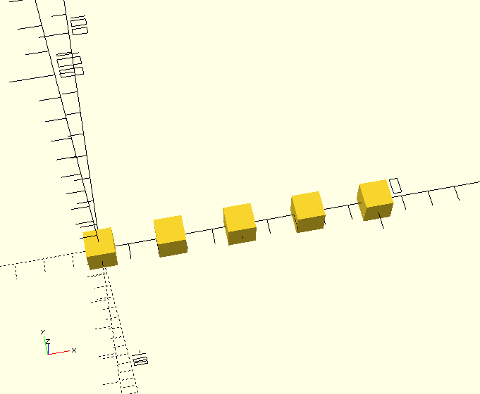

> NOTE: 100mm is measured between centers of the boxes, the whole space taken up will be (range + boxsize) which is in our case 110 mm

```.scad
include <constructive-compiled.scad>

pieces(8) X(span(100)) turnYZ(span(90)) box(10);
```

Will create 8 boxes with their centers filling a range of 100 mm and each one turned in YZ axis by an appropriate angle picked from the [0:90] range
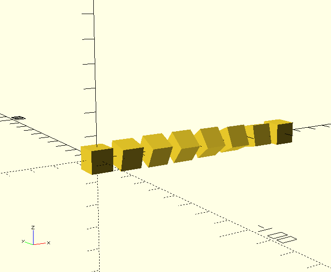

> NOTE: pieces(_n_) span(_range_) will put a body or run _n_ times to span all the _range_. including the upper range limit. For example the pieces(3) turnXY(span(180)) X(20) box(10); above, will put a box each at 0°,90°a and 180° degrees, which is what you most probably want.
> But if you want to have  full circle (360°) range or run it from an outer for() you will need to use

#### spanAllButLast(range) vs span(range) differences

Instead of span(range)
it works just the same like span() but does not put an element at the very end of the range, placing all elements closer together to leave a space at the end for just another element. You might use it when you use pieces(n) to span full closed circle(360°), For Example:

```.scad
include <constructive-compiled.scad>

pieces(3) turnXY(span(180)) X(20) box(10);
```

Will create 3 boxes at 0, 90 and 180 degrees, which is just fine
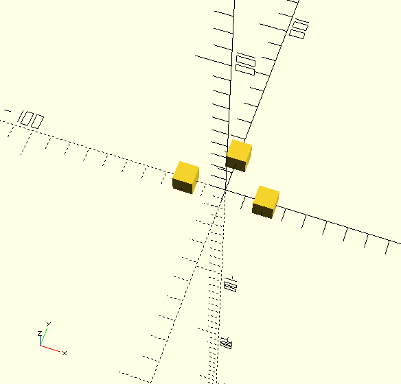

,but the:

```.scad
include <constructive-compiled.scad>

pieces(3) turnXY(span(360)) X(20) box(10);
```

Will create 3 boxes, each one at at  0°, 180° and 360° degrees, the 0° and 360° is the same Angle, so the first and the last box are drawn at the same position, so there will be only two discernable boxes visible, which is most probably not what you want.
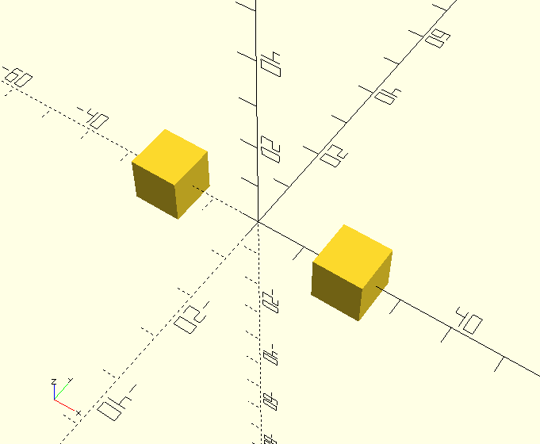

What you probably wanted in this case is to put boxes at positions 0°, 120°, 240° so there are thee boxes visible, and the first hand last one are not drawn at the same position like above.

```.scad
include <constructive-compiled.scad>

pieces(3) turnXY(spanAllButLast(360)) X(20) box(10);
```

Will do just exactly that, so use it when you want to span 360°,
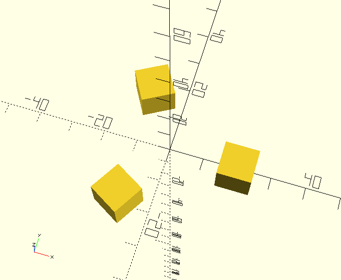

To further illustrate the difference, look at the following example spanning 100 mm (between centers) :

```.scad
include <constructive-compiled.scad>

pieces(5) X(span(100)) ball(10);
```

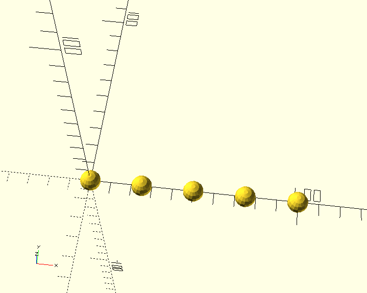

And the following, placing the balls closer to each other, to leave a space for a just one more ball at the end. This one will be useful when using pieces(n) ...span(range). Within another for() "cycle". So that the first element in the next for() iteration could take the space left for the last one

```.scad
include <constructive-compiled.scad>

pieces(5) X(spanAllButLast(100)) ball(10);
```

Will produce:

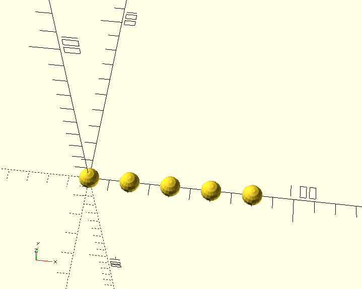

----

> NOTE: that

```.scad
spanAllButLast(range)
```

Is same as

```
span(n,allButLast=true)
```

----

#### specific value for each piece: vals(val1,val2,val3,...)

```.scad
include <constructive-compiled.scad>

pieces(6) X(span(120)) Z(vals(10,20,40,15,25,35)) ball(20);
```

This will pick one value from the list of arguments of vals(10,20,40,15,25,35) for each peace,
of course you will need to provide enough values, so each peace gets one.
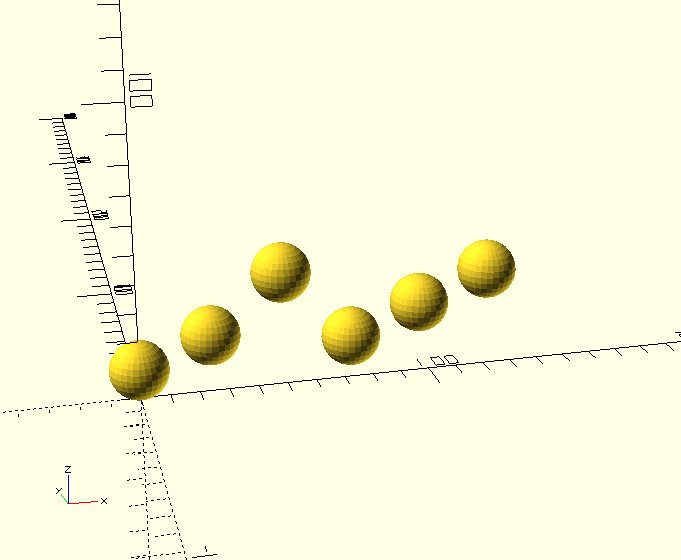

---

Wrapping the vals() function grouping command g() (explained later) will also allow you to use movement or turning commands themselves as single values in the value list:

```.scad
include <constructive-compiled.scad>

pieces(3) g(vals(X(20),X(40)*Y(20),turnXY(45)*X(100)))
  color(vals(red,green,blue))
    ball(15);
```

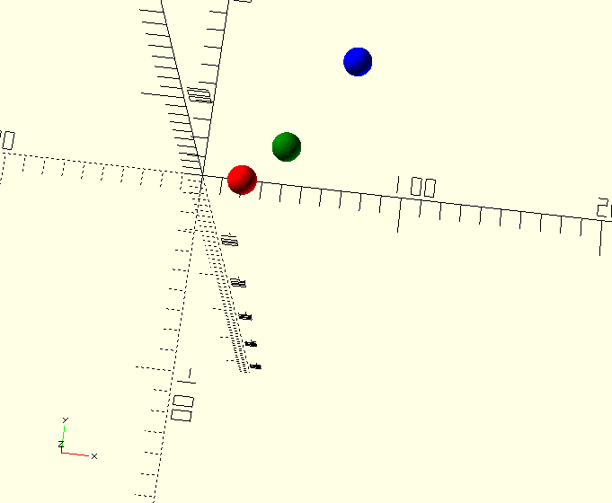  

> NOTE: the asterisk '*' is used to connect several different commands into a single value,which will be used for one piece of the pieces(3). Behind the scenes, movement or turning commands are represented as matrices so multipling arbitrarary number of such command to another ones will result in  a new matrix, which represents a command containing all the transformations from each command multiplied   

### vRepeat(val1,val2,...)

When using the vals() function you need to provide a value for each piece created.
vRepeat works almost the same, but if you have more pieces than values, like say: pieces(15) and only 4 values (10,20,30,40) the vRepeat will use all (in our case 4 ) values given and then start over, applying the values as a repeating pattern:

```.scad
include <constructive-compiled.scad>

pieces(15) X(span(200))
  Y(vRepeat(0,10,30,70))
    color(vRepeat(red,green,blue,cyan))
      ball(15);
```

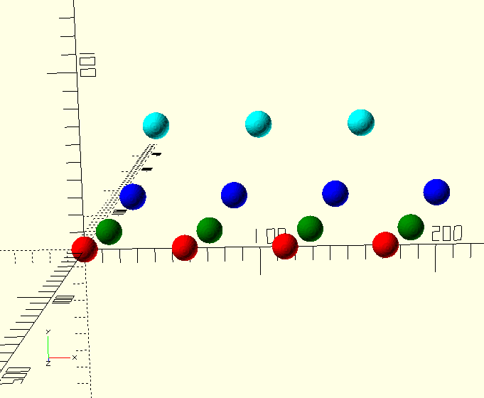  

---

### vSpread(val1,val2,...)

Works similar to vRepeat, but instead of repeating the Pattern, tries to evenly Spread the Pattern among all Elements, repeating not the whole Sequence, but every element instead, "Spreading its value among several neighbouring Pieces

```.scad
include <constructive-compiled.scad>

pieces(15) X(span(200))
  Y(vSpread(0,10,30,70))
    color(vSpread(red,green,blue,cyan))
      ball(15);
```

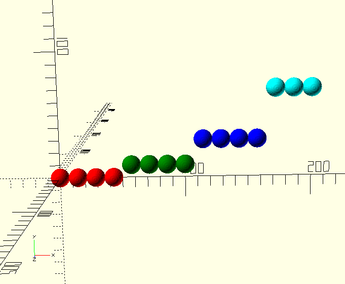  

----

#### skipFirst(n=1)

Omits a command or block for the first n pieces,
consider following example:

```.scad
include <constructive-compiled.scad>

pieces(15) X(span(200))
  {
    TOUP()ball(10);

    skipFirst(10)
      box(10,h=2);  
  }
```

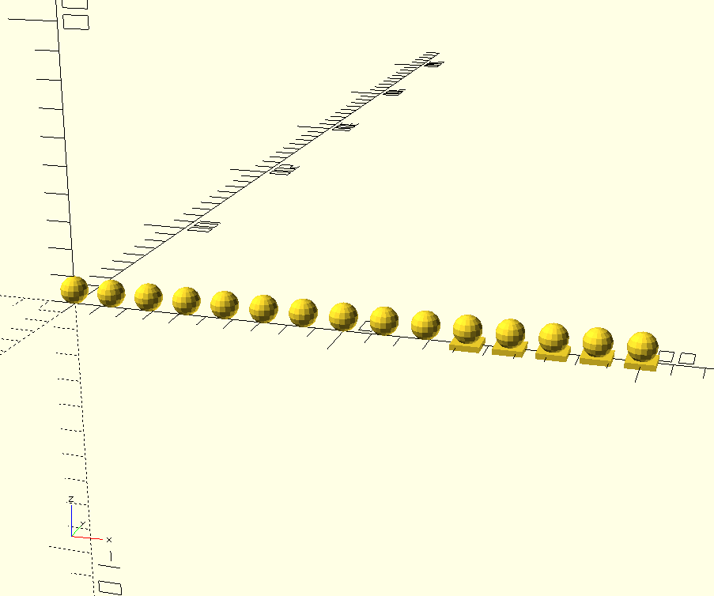  

As you can see the box() command is only run starting with 11th piece

----

#### ifFirst(n=1)

Runs a command or block only for the first n pieces,
consider following example:

```.scad
include <constructive-compiled.scad>

pieces(15) X(span(200))
  {
    TOUP()ball(10);

    ifFirst(5)
      box(10,h=2);  
  }
```

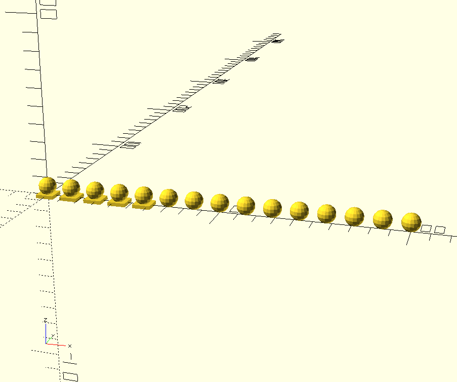  

----

#### ifLast(n=1)

Runs a command or block only for the last n pieces,
consider following example:

```.scad
include <constructive-compiled.scad>

pieces(15) X(span(200))
  {
    TOUP()ball(10);

    ifLast(2)
      box(10,h=2);  
  }
```

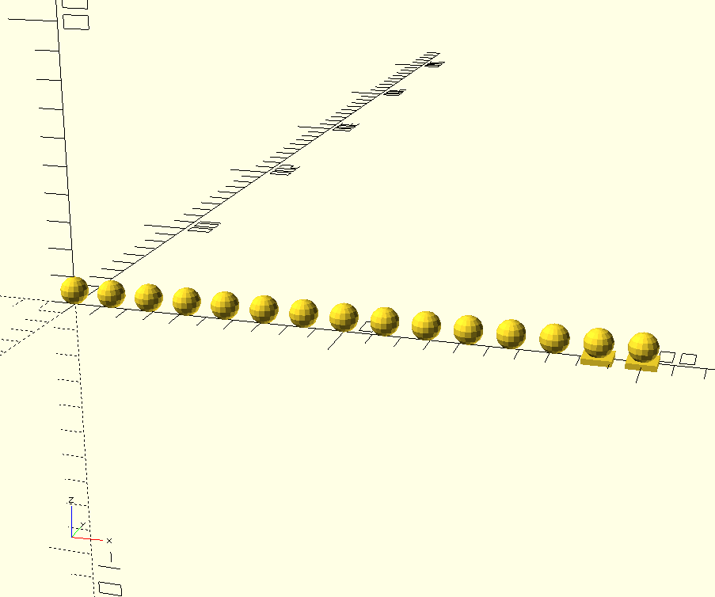  

----

#### selectPieces( decisionList =[...])

selectPieces decides for each piece to run a block on not.
It runs a block for piece number n if the according boolean value in the decisionList[n] is true:

```.scad
include <constructive-compiled.scad>

pieces(5) X(span(200))
  {
    TOUP()ball(10);

    selectPieces([true,false,false,true])
      box(10,h=2);  
  }
```

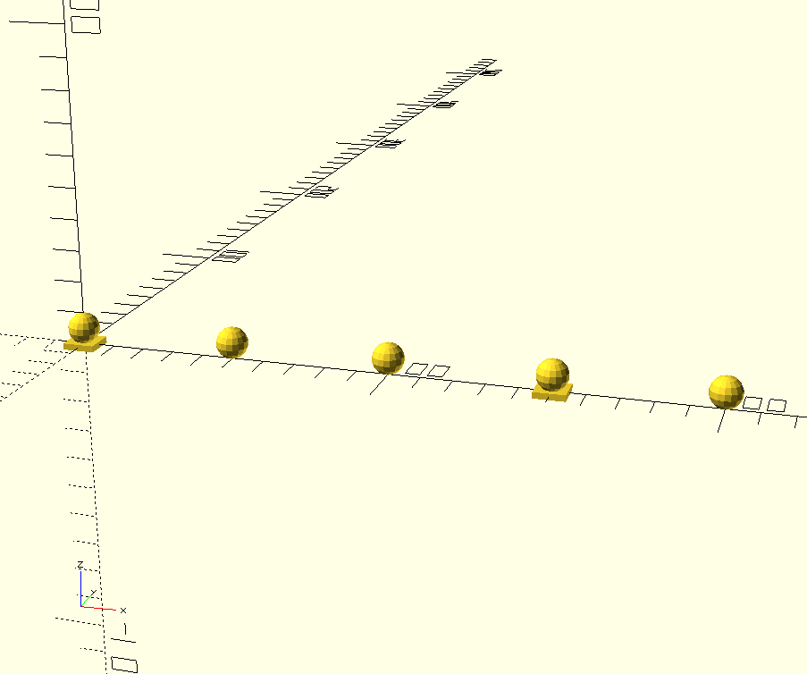  

----

### runFor(conditionList=[true]) vs pieces(n)

runFor(conditionList=[...])
works like pieces(n) but lets you select particular piece numbers to create, where pieces(n) calls its children for every number [0...n-1], runFor(conditionList=[...]) takes a list of n bool values as a parameter.
Is a short for writing

```.scad
 pieces(n) selectPieces(conditionList=[...])
```

The n argument for the pieces(n) is autodetermined counting the elements in the conditionList

```.scad
include <constructive-compiled.scad>

runFor([true,false,false,true,false,true,true])
 X(span(100))
  {
    TOUP()ball(10);
    box(10,h=2);  
  }
```

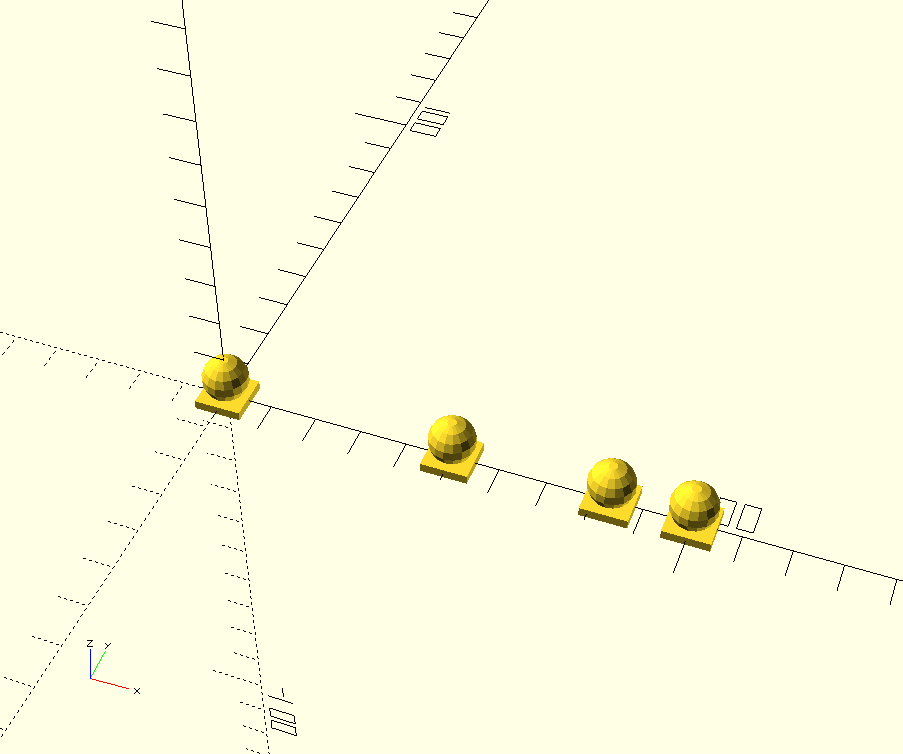
---

#### \$valPtr

\$valPtr is a Constractive system variable, which can tell you the number of the current piece in the pieces(n) body.
Using it allows you to implement your own logic on how to filter or change elements, in cases vals(), sides(), selectPieces() are to cumbersome to express the conditions intent.

> in fact, behind the scenes pieces(n) is translated into vanilla OpenScad along lines of for($varPtr=[0:1:n])

```.scad
include <constructive-compiled.scad>

pieces(10)
 X(span(100))
{
  if($valPtr==3)
    ball(10);
  else if($valPtr< 3 || $valPtr >4)
    box(10,h=$valPtr*4+1);   
}
```

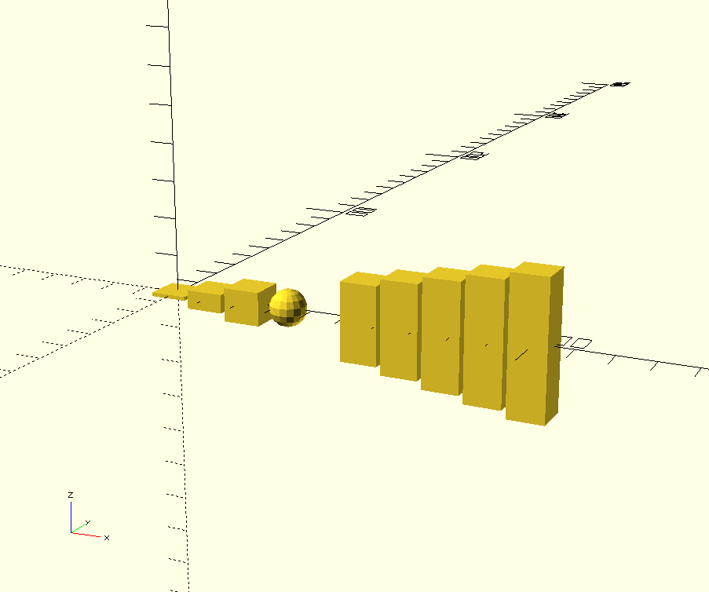
---  
For a **basic introduction**** (specially if you are new to Openscad)
see the [beginners tutorial](./basic-tutorial.md) it explains Constructive Syntax for main Building blocks, like tube(), box() or bentStrip() and their placement and alignment in space like stack() , align(), X(),Y(),Z() or turnXZ()

[Part II tutorial](./tutorial-partII.md) shows some basic object modification like reflectX(), cScale() or colors and then goes on to explain, how to work with sets of similar objects without for(), with: pieces(), span(), vals(), selectPieces(), etc..

[Part III tutorial](./tutorial-partIII.md) shows more advanced Features like grouping commands into a g() group, working with Parts, and combining them into Assembly
